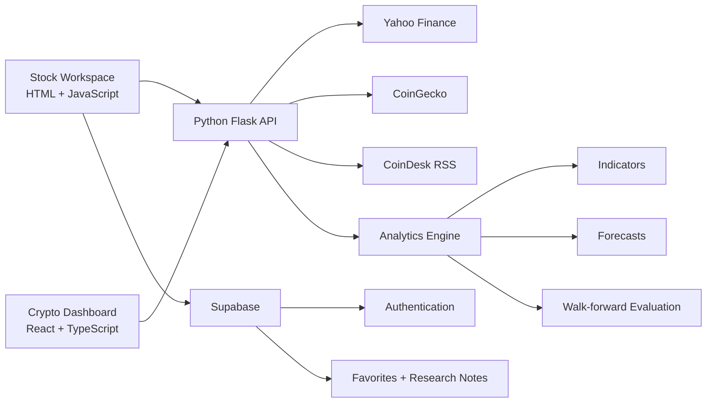

<div align="center">

# Predict

**Stock and cryptocurrency research workspace with live market data, transparent statistical forecasting, analytics, and portfolio research tools**

[Live Demo](https://stock-price-prediction-bice.vercel.app/) ·
[GitHub Repository](https://github.com/Anna-Vida/Stock-Price-Prediction)


</div>

---

## Overview

**Predict** is a market research application for exploring stocks and cryptocurrencies from a single workspace.

The stock side combines live historical market data, technical indicators, risk metrics, transparent statistical forecasts, walk-forward evaluation, watchlists, research notes, target prices, alerts, and CSV exports.

The crypto side uses a React + TypeScript dashboard for live cryptocurrency market cards, searchable assets, seven-day price charts, trending data, and market news.

The project intentionally separates **real provider data** from **synthetic demo data**. Provider failures are surfaced explicitly, stale cache responses are labeled, and demo data is never silently substituted for live prices.

> **Educational research only. Forecasts are uncertain and this project is not financial advice.**

---

## What This Project Demonstrates

- Python API development with Flask and Waitress
- Live market-data integration
- Transparent quantitative forecasting
- Walk-forward model evaluation
- Risk and technical indicator calculations
- Data validation and stale-cache handling
- React + TypeScript integration inside an existing JavaScript application
- Responsive dashboard development
- Supabase authentication and Row Level Security
- Local-first persistence with cloud synchronization
- Browser integration testing with Playwright
- Python backend testing
- GitHub Actions CI
- Vercel, Render, and Docker deployment options

---

## Main Features

### Stock Research Workspace

The stock workspace includes:

- Searchable stock directory
- 20 predefined market symbols
- Personal watchlist
- 1-month, 3-month, and 1-year chart windows
- Historical daily price data
- Research notes
- Target prices
- Price alerts
- CSV export
- Explicit offline/demo mode

Current analytics include:

- Period return
- Annualized volatility
- Maximum drawdown
- 14-session RSI
- 20-session moving average
- 50-session moving average
- Average volume
- Trend signal

### Statistical Forecasting

Predict provides forecasts for:

- 1 trading session
- 7 trading sessions
- 30 trading sessions

The current model is a **damped log-return drift model**, not a neural network.

It uses recent log returns, shrinks estimated drift toward zero, and projects forward from the latest completed historical close.

Each forecast includes:

- Expected price
- Lower model band
- Upper model band

The interface also includes walk-forward historical evaluation using only information available at each forecast origin.

Evaluation metrics include:

- MAE
- RMSE
- MAPE
- Directional accuracy
- Historical interval coverage
- Last-close baseline comparison

The application does not claim that the model will outperform the baseline or predict future markets accurately.

---

## Forecast Methodology

The model estimates the most recent 60 daily log returns and applies:

```text
damped drift = mean(recent log returns) × 0.5
```

Expected price:

```text
expected = latest close × exp(damped drift × horizon)
```

The displayed 95% model band uses recent return volatility and assumes independent normal log returns.

Important limitations:

- Forecast horizons use trading sessions, not calendar days
- Evaluation outcomes may overlap
- Historical interval coverage is not a future calibration guarantee
- Parameter uncertainty and many real-world market risks are not modeled
- Historical directional accuracy is not forecast confidence

At least 90 valid daily observations are required before analytics are produced.

---

## Market Data

### Stocks

Stock history is requested from Yahoo Finance using two years of daily observations.

The backend:

- Uses adjusted close data when available
- Preserves date and volume alignment
- Rejects duplicate or unordered timestamps
- Excludes only an unfinished current trading session
- Preserves missing volume values instead of replacing them with zero
- Uses exchange timezone information
- Applies a 12-second provider timeout

Responses are cached for 60 seconds.

If the provider becomes unavailable, a previously successful response less than 15 minutes old may be returned with:

```text
stale: true
```

If no recent cache is available, the API returns an explicit provider error.

### Cryptocurrency

Cryptocurrency data is requested from CoinGecko through the Python backend.

The dashboard supports:

- Live USD prices
- 24-hour change
- Market capitalization
- Trading volume
- 24-hour high and low
- Market-cap rank
- Seven-day price history
- Coin search
- Up to 20 selected assets
- Trending assets
- Market news feed
- Explicit synthetic demo mode

A CoinGecko Demo API key can optionally be configured through:

```env
COINGECKO_DEMO_API_KEY=...
```

The key stays on the server and is never embedded in browser assets.

---

## Architecture



### Application layers

```text
Browser
├── Stock workspace
│   ├── HTML
│   ├── Vanilla JavaScript
│   └── Tailwind CSS
│
└── Crypto dashboard
    ├── React
    ├── TypeScript
    └── Vite bundle

Python backend
├── Flask API
├── Waitress production server
├── Stock provider integration
├── Crypto provider integration
└── Statistical analytics

Optional cloud layer
└── Supabase
    ├── Authentication
    ├── Favorites
    ├── Stock notes
    └── Row Level Security
```

---

## Crypto Dashboard

The crypto dashboard is implemented as a React/TypeScript feature inside the wider project rather than as a separate application.

Key source locations:

```text
components/ui/crypto-dashboard.tsx
src/crypto-main.tsx
crypto.html
crypto_api.py
```

The dashboard includes:

- Searchable coins by name or symbol
- Persistent local selection
- Add/remove controls
- Seven-day charts
- Mouse, touch, and keyboard chart exploration
- Provider timestamps
- Explicit stale-data states
- Explicit provider-error states
- Local icon fallback
- Request cancellation

The compiled production bundle is written to:

```text
public/crypto/dashboard.js
```

---

## Supabase Authentication and Sync

Supabase is optional.

Guest users can use local watchlists and notes without an account.

Signed-in users can synchronize:

- Favorite stock symbols
- Research notes
- Target prices
- Alert thresholds

Database tables:

```text
favorites
stock_notes
```

Row Level Security ensures authenticated users can only manage rows associated with their own user ID.

The application also protects pending local edits during synchronization. Failed signed-in writes remain queued locally and retry after sign-in, browser reconnection, or future visible-page refreshes.

This protects a single browser from older in-flight responses overwriting newer local edits. It is not intended as cross-device conflict resolution.

---

## API Reference

### Core API

| Endpoint | Purpose |
| --- | --- |
| `/api/health` | Python service health |
| `/api/markets` | Stock ticker directory |
| `/api/quote?symbol=NVDA` | Quote, history, analytics, forecasts, and backtests |
| `/api/quote?symbol=NVDA&demo=1` | Explicit synthetic stock demo |

### Crypto API

| Endpoint | Purpose |
| --- | --- |
| `/api/crypto/markets?ids=bitcoin,ethereum` | Market data and seven-day history |
| `/api/crypto/search?q=bitcoin` | Coin search |
| `/api/crypto/trending` | Trending cryptocurrency assets |
| `/api/crypto/news` | Cryptocurrency news feed |

Crypto market and search endpoints support explicit demo data through `demo=1`.

Input rules include:

- Maximum 20 coin IDs
- Deduplicated market IDs
- Validated coin identifiers
- Search queries limited to 60 characters

---

## Tech Stack

| Area | Technologies |
| --- | --- |
| **Stock frontend** | HTML5, Vanilla JavaScript, Tailwind CSS 4 |
| **Crypto frontend** | React 19, TypeScript, Vite 8, Framer Motion, Lucide React |
| **Backend** | Python 3.12+, Flask 3.1, Waitress |
| **Analytics** | Python standard library statistics/math |
| **Stock data** | Yahoo Finance chart endpoint |
| **Crypto data** | CoinGecko |
| **News** | CoinDesk RSS |
| **Authentication / cloud sync** | Supabase |
| **Browser testing** | Playwright |
| **Backend testing** | Python unittest |
| **CI** | GitHub Actions |
| **Deployment** | Vercel, Render, Docker |

---

## Repository Structure

```text
Stock-Price-Prediction/
├── .github/
│   └── workflows/
│       └── checks.yml
├── components/
│   └── ui/
├── demos/
├── lib/
├── public/
│   └── crypto/
│       └── dashboard.js
├── src/
│   ├── crypto-main.tsx
│   └── input.css
├── tests/
│   ├── browser.cjs
│   ├── crypto.cjs
│   ├── sync.cjs
│   ├── test_backend.py
│   └── test_crypto.py
├── analytics.py
├── app.js
├── crypto.html
├── crypto_api.py
├── developer.html
├── index.html
├── server.py
├── supabase-config.js
├── supabase-schema.sql
├── package.json
├── requirements.txt
├── Dockerfile
├── render.yaml
├── vercel.json
└── README.md
```

---

## Getting Started

### Requirements

For the complete development environment:

- Python 3.12+
- Node.js 22.12+
- npm

Node.js is only required when rebuilding frontend assets.

### Clone the Repository

```bash
git clone https://github.com/Anna-Vida/Stock-Price-Prediction.git
cd Stock-Price-Prediction
```

### Python Environment

Windows PowerShell:

```powershell
python -m venv .venv
.\.venv\Scripts\python -m pip install -r requirements.txt
.\.venv\Scripts\python server.py
```

macOS/Linux:

```bash
python -m venv .venv
./.venv/bin/python -m pip install -r requirements.txt
./.venv/bin/python server.py
```

Open:

```text
http://localhost:5500
```

### Windows Launcher

The repository also includes:

```powershell
.\start.ps1
```

This can use the project-local Python runtime under `.tools/python` when available.

---

## Frontend Development

Install Node dependencies:

```bash
npm ci
```

Build all frontend assets:

```bash
npm run build
```

This performs:

```text
TypeScript type checking
        ↓
Vite crypto bundle build
        ↓
Tailwind CSS build
```

Individual commands:

```bash
npm run typecheck
npm run build:crypto
npm run build:css
```

Stock interface code:

```text
index.html
app.js
```

Crypto interface code:

```text
components/ui/
src/crypto-main.tsx
```

Shared Tailwind source:

```text
src/input.css
```

---

## Testing

### Python tests

```bash
python -m unittest discover -s tests -v
```

### JavaScript syntax

```bash
node --check app.js
```

### Production frontend build

```bash
npm run build
```

### Browser integration tests

Start the Python server, then run:

```bash
node tests/browser.cjs
node tests/sync.cjs
node tests/crypto.cjs
```

The browser tests cover the real local Python API in explicit demo mode, provider failures, delayed responses, local/cloud synchronization behavior, and crypto interactions.

---

## Continuous Integration

GitHub Actions runs application checks on pushes and pull requests.

The workflow uses:

- Python 3.12
- Node.js 24
- Python unit tests
- JavaScript syntax checks
- TypeScript checks
- Vite production build
- Tailwind production build
- Generated-asset consistency checks
- Playwright Chromium
- Stock browser integration tests
- Supabase synchronization tests
- Crypto browser integration tests

Workflow:

```text
.github/workflows/checks.yml
```

---

## Deployment

### Vercel

Live deployment:

**https://stock-price-prediction-bice.vercel.app/**

The project uses Vercel's Python runtime for `server.py` and serves the stock workspace, crypto dashboard, frontend assets, and API from the same deployment.

### Render

`render.yaml` defines a Python web service that:

```text
pip install -r requirements.txt
        ↓
python server.py
        ↓
GET /api/health
```

Render can host the complete application from one service.

### Docker

Build:

```bash
docker build -t predict .
```

Run:

```bash
docker run --rm -p 5500:5500 predict
```

The image packages the Python application and compiled frontend assets and runs the application as a non-root user.

---

## Data Integrity and Safety Decisions

The project intentionally avoids several misleading behaviors common in market demos:

- No silent fallback from failed live providers to synthetic prices
- No fabricated chart history when provider history is missing
- No claim that model bands are guaranteed confidence intervals
- No claim that historical accuracy equals future forecast confidence
- No automatic zero replacement for missing trading volume
- No service-role Supabase key in browser code
- No arbitrary source/configuration file serving from Flask
- No use of stale quotes for threshold alerts

These decisions keep the UI explicit about what data is real, stale, unavailable, or synthetic.

---

## Current Status

### Implemented

- Stock market research dashboard
- Cryptocurrency dashboard
- Live stock and crypto provider integration
- Historical charting
- Watchlists
- Technical and risk analytics
- Statistical price forecasts
- Walk-forward forecast evaluation
- CSV exports
- Research notes and alert thresholds
- Explicit synthetic demo mode
- Supabase authentication
- Cloud favorites and notes
- Row Level Security
- Local-first sync queue
- Browser accessibility improvements
- Python backend tests
- Playwright browser tests
- GitHub Actions CI
- Vercel deployment
- Render configuration
- Docker configuration

### Possible Future Improvements

- Additional market data providers
- More forecasting models for side-by-side comparison
- Portfolio-level analytics
- Expanded fundamental company data
- More crypto research indicators
- Additional export formats
- Broader automated accessibility testing

---

## My Contribution

**Role: Sole Developer / Full-Stack Developer**

I designed and built **Predict independently from end to end**. My contribution covered the stock and cryptocurrency interfaces, Python backend, market-data integrations, statistical analytics, forecasting logic, local/cloud persistence, automated testing, CI, and deployment configuration.

Key areas I implemented include:

- Stock research interface with HTML, JavaScript, and Tailwind CSS
- React + TypeScript cryptocurrency dashboard
- Flask + Waitress backend API
- Yahoo Finance and CoinGecko market-data integrations
- Statistical forecasting and walk-forward evaluation
- Risk and technical indicators
- Caching, stale-data handling, and provider error states
- Supabase authentication, favorites, notes, and Row Level Security
- Local-first synchronization behavior
- Python and Playwright test suites
- GitHub Actions CI
- Vercel, Render, and Docker deployment configuration

This project represents my work as the **sole developer responsible for both the frontend and backend implementation**.

---

## Author

**Anna Patricia B. Vida**

- GitHub: [Anna-Vida](https://github.com/Anna-Vida)
- LinkedIn: [annavida12](https://www.linkedin.com/in/annavida12/)

---

## Disclaimer

Predict is an educational and research project.

Market data may be delayed, incomplete, unavailable, or subject to third-party provider limitations. Statistical forecasts are uncertain and should not be interpreted as investment recommendations, guarantees, or financial advice.